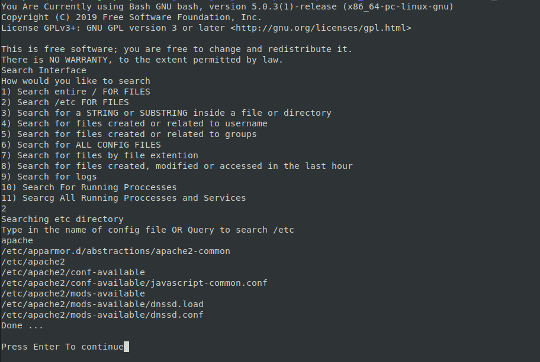

# Find Files 

## Overview:
This utility helps a user find files in a quick and easy manner. This eliminates researching different files and extentions by command.

## Why?
Sysadmin or users wanting to know where an applications configs or logs are located without actually knowing its absolute path.

## How to use?
With root access run the script and follow the easy to use interface. Here is an example screenshot

