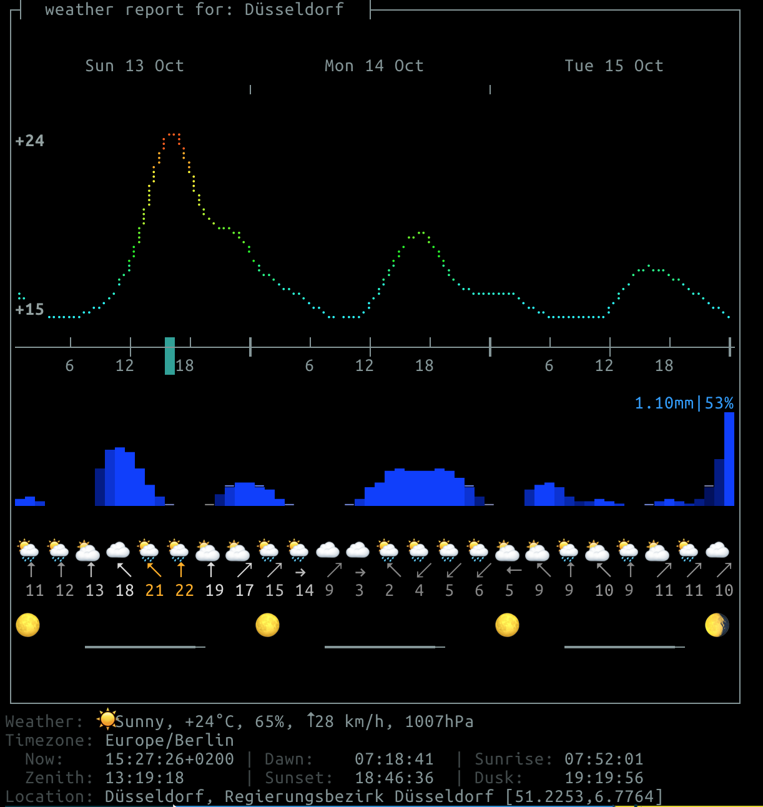

# Check the weather from the command line

## How to use?
Just execute `weather/forecast.sh Your City` and get back the weather forecast

Thanks to the author. This is only a helper script.

https://github.com/chubin/wttr.in